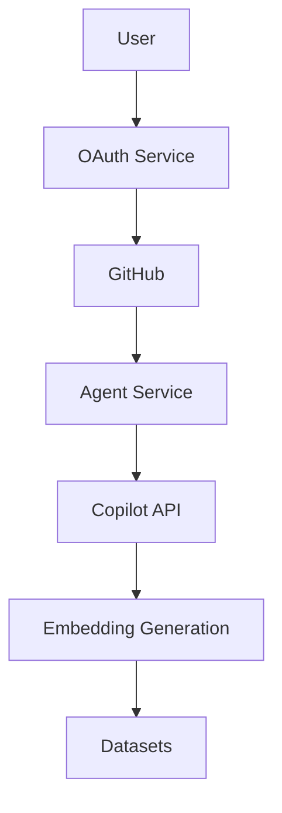
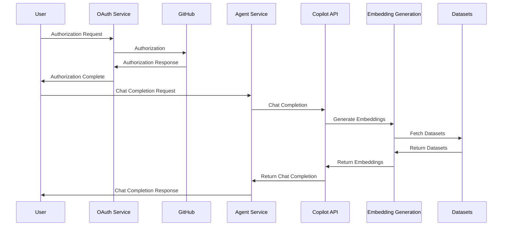

# Repository Report

## File Tree Structure

```
.
├── agent
│   └── service.go
├── config
│   └── info.go
├── copilot
│   ├── endpoints.go
│   └── messages.go
├── data
│   ├── app_configuration.md
│   ├── payload_verification.md
│   ├── request_format.md
│   └── response_format.md
├── embedding
│   └── datasets.go
├── main.go
├── oauth
│   └── handler.go
├── README.md
├── LICENSE.txt
├── CODE_OF_CONDUCT.md
├── SECURITY.md
├── SUPPORT.md
└── go.mod
```

## Directory and File Descriptions

### agent
- [service.go](./agent/service.go): Contains the implementation of the `Service` struct and its methods for handling chat completions.

### config
- [info.go](./config/info.go): Defines the `Info` struct and a function to create a new instance of it using environment variables.

### copilot
- [endpoints.go](./copilot/endpoints.go): Contains functions for making HTTP requests to the Copilot API for chat completions and embeddings.
- [messages.go](./copilot/messages.go): Defines the structures for chat requests, messages, and embeddings.

### data
- [app_configuration.md](./data/app_configuration.md): Provides information on configuring a Copilot app.
- [payload_verification.md](./data/payload_verification.md): Describes payload verification for requests.
- [request_format.md](./data/request_format.md): Details the request format for the agent.
- [response_format.md](./data/response_format.md): Details the response format for the agent.

### embedding
- [datasets.go](./embedding/datasets.go): Provides functions for creating embeddings, generating datasets, and finding the best dataset based on embeddings.

### main.go
- [main.go](./main.go): Contains the main function that sets up the HTTP server and routes for the agent and OAuth service.

### oauth
- [handler.go](./oauth/handler.go): Provides the implementation of the OAuth service for handling authorization and callback endpoints.

### Root Directory Files
- [README.md](./README.md): Provides a description of the project, prerequisites, installation instructions, usage, and how to access the agent in chat.
- [LICENSE.txt](./LICENSE.txt): Contains the MIT License.
- [CODE_OF_CONDUCT.md](./CODE_OF_CONDUCT.md): Contains the Contributor Covenant Code of Conduct.
- [SECURITY.md](./SECURITY.md): Provides security information.
- [SUPPORT.md](./SUPPORT.md): Provides support information.
- [go.mod](./go.mod): Contains the module definition and dependencies for the project.

## Additional Documentation

### Architecture and Workflow

The RAG (Retrieval-Augmented Generation) framework in this repository functions by integrating various tools and components to handle chat completions and embeddings. Here are the key aspects of its functionality, tools, components, architecture, and workflow:

* **Service struct**: The `Service` struct in `agent/service.go` provides an endpoint for the agent to perform chat completions. It initializes datasets and handles incoming requests.

* **Copilot API**: The `copilot` package, including `copilot/endpoints.go` and `copilot/messages.go`, contains functions for making HTTP requests to the Copilot API for chat completions and embeddings. It defines the structures for chat requests, messages, and embeddings.

* **Embedding generation**: The `embedding` package, specifically `embedding/datasets.go`, provides functions for creating embeddings, generating datasets, and finding the best dataset based on embeddings. It uses the Copilot API to fetch embeddings and score similarity using Cosine Similarity.

* **Configuration**: The `config/info.go` file defines the `Info` struct and a function to create a new instance of it using environment variables. This configuration is used to set up the application.

* **OAuth service**: The `oauth/handler.go` file provides the implementation of the OAuth service for handling authorization and callback endpoints. It ensures secure communication and authorization with GitHub.

* **Main function**: The `main.go` file contains the main function that sets up the HTTP server and routes for the agent and OAuth service. It fetches the public key, initializes the configuration, and starts the server.

* **Documentation**: The `data` directory contains various documentation files, such as `data/app_configuration.md`, `data/payload_verification.md`, `data/request_format.md`, and `data/response_format.md`. These files provide information on configuring the Copilot app, payload verification, request format, and response format.

* **Licenses and code of conduct**: The `LICENSE.txt` file contains the MIT License, and the `CODE_OF_CONDUCT.md` file contains the Contributor Covenant Code of Conduct. These documents ensure proper usage and behavior within the project.

* **Repository report**: The `repository_report.md` file provides a comprehensive report on the directories and files in the repository, including a file tree structure and descriptions of each directory and file.

## Code Snippets

### agent/service.go

```go
// NewService creates a new instance of the Service struct
func NewService(pubKey *ecdsa.PublicKey) *Service {
    return &Service{
        pubKey:       pubKey,
        datasetsInit: &sync.Once{},
    }
}

// ChatCompletion handles chat completion requests
func (s *Service) ChatCompletion(w http.ResponseWriter, r *http.Request) {
    sig := r.Header.Get("Github-Public-Key-Signature")

    body, err := io.ReadAll(r.Body)
    if err != nil {
        fmt.Println(fmt.Errorf("failed to read request body: %w", err))
        w.WriteHeader(http.StatusInternalServerError)
        return
    }

    // Make sure the payload matches the signature. In this way, you can be sure
    // that an incoming request comes from github
    isValid, err := validPayload(body, sig, s.pubKey)
    if err != nil {
        fmt.Printf("failed to validate payload signature: %v\n", err)
        w.WriteHeader(http.StatusInternalServerError)
        return
    }
    if !isValid {
        http.Error(w, "invalid payload signature", http.StatusUnauthorized)
        return
    }

    apiToken := r.Header.Get("X-GitHub-Token")
    integrationID := r.Header.Get("Copilot-Integration-Id")

    var req *copilot.ChatRequest
    if err := json.Unmarshal(body, &req); err != nil {
        fmt.Printf("failed to unmarshal request: %v\n", err)
        w.WriteHeader(http.StatusBadRequest)
        return
    }
    if err := s.generateCompletion(r.Context(), integrationID, apiToken, req, w); err != nil {
        fmt.Printf("failed to execute agent: %v\n", err)
        w.WriteHeader(http.StatusInternalServerError)
    }
}
```

### config/info.go

```go
// New creates a new instance of the Info struct using environment variables
func New() (*Info, error) {
    port := os.Getenv(portEnv)
    if port == "" {
        return nil, fmt.Errorf("%s environment variable required", portEnv)
    }

    fqdn := os.Getenv(fqdnEnv)
    if fqdn == "" {
        return nil, fmt.Errorf("%s environment variable required", fqdnEnv)
    }

    clientID := os.Getenv(clientIdEnv)
    if clientID == "" {
        return nil, fmt.Errorf("%s environment variable required", clientIdEnv)
    }

    clientSecret := os.Getenv(clientSecretEnv)
    if clientSecret == "" {
        return nil, fmt.Errorf("%s environment variable required", clientSecretEnv)
    }

    return &Info{
        Port:         port,
        FQDN:         fqdn,
        ClientID:     clientID,
        ClientSecret: clientSecret,
    }, nil
}
```

## Future Improvements

1. **Refactoring**: Consider refactoring the code to improve readability and maintainability. For example, breaking down large functions into smaller, more manageable ones.
2. **Optimization**: Optimize the code for better performance. This could include improving the efficiency of algorithms or reducing the memory footprint.
3. **New Features**: Add new features to enhance the functionality of the project. For example, adding support for additional APIs or integrating with other services.

## Glossary

- **RAG (Retrieval-Augmented Generation)**: A framework that integrates various tools and components to handle chat completions and embeddings.
- **Copilot API**: An API provided by GitHub Copilot for chat completions and embeddings.
- **Embedding**: A representation of text in a numerical format that can be used for various natural language processing tasks.
- **OAuth**: An open standard for access delegation, commonly used for token-based authentication and authorization.

## Visual Aids

### Architecture Diagram



### Workflow Diagram


